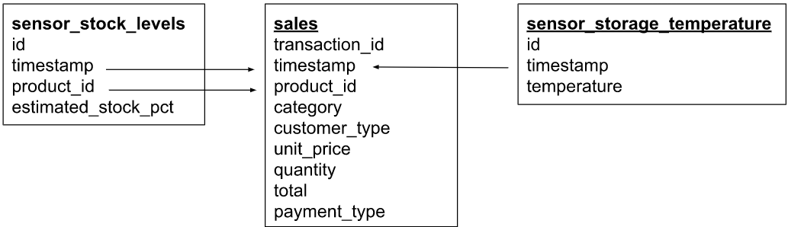
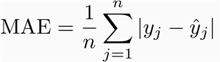
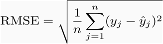

# Stock level prediction (Em desenvolvimento............)
## Sobre o problema

Gala Groceries é uma cadeia de supermercados liderada por tecnologia com sede nos EUA. Eles dependem muito de novas 
tecnologias, como a IoT, para lhes dar uma vantagem competitiva sobre outros supermercados. 

Eles se orgulham de fornecer a melhor qualidade e produtos frescos de fornecedores de origem local. No entanto, isso 
traz muitos desafios para cumprir consistentemente esse objetivo o ano todo.

Gala Groceries procurou a Cognizant para ajudá-los com um problema na cadeia de suprimentos. Compras são itens altamente
perecíveis. Se você exagerar, estará desperdiçando dinheiro com armazenamento e desperdício excessivos, mas se você
subestima, corre o risco de perder clientes. Eles querem saber como estocar melhor os itens que vendem.

## Questão de negócio

Podemos prever com precisão os níveis de estoque de produtos com base em dados de vendas e dados de sensores a cada 
hora, a fim de adquirir produtos de maneira mais inteligente de nossos fornecedores? 

## Sobre os dados

O cliente concordou em compartilhar mais dados na forma de dados do sensor. Eles usam sensores para medir as instalações
de armazenamento de temperatura onde os produtos são armazenados no armazém e também usam níveis de estoque dentro dos 
refrigeradores e freezers na loja. 



Este diagrama de modelo de dados nos trás 3 tabelas:
- vendas = dados de vendas
- sensor_storage_temperature = Dados IoT dos sensores de temperatura na instalação de armazenamento para os produtos
- sensor_stock_levels = níveis estimados de estoque de produtos com base em sensores IoT

Relações entre tabelas:

São representadas pelas setas, indicando quais colunas usar para mesclagem.

## Métricas

Para a avaliação do modelo, serão usadas MAE e RMSE, visando buscar um valor que seja o mais próximo possível a 0
e que sejam próximos entre si. Com essa proximidade, saberemos que previsões muito discrepantes dos valores reais não 
estão sendo feitas pelo modelo.





## Característica dos dados
No geral, os dados estão divididos em 3 tabelas, conforme diagrama exposto em sessão anterior. Após análise exploratória
inicial, foi possível identificar alguns pontos importantes do ponto de vista do negócio e de modelagem. 

#### Modelagem:
- No geral, temos 3 colunas categóricas, 5 numéricas e 1 datetime. As outras representam id's únicos.
- As colunas categóricas estão bem balanceadas.
- As colunas numéricas **total** e **unit_price** da tabela **df_vendas** apresentam outliers, sendo necessário investigar se são naturais ou 
não.
- Apesar de ser datetime, a coluna que apresenta este tipo de dado está no formato de **object**, sendo necessário 
alterar o tipo
- Não existem valores duplicados
- Para a junção das tabelas, a coluna de id e datas devem ser usados. 
- As datas das vendas são diferentes das datas das tabelas que contém dados dos sensores, será necessário alterar esse
dado para que possam ser usados para juntar as tabelas.
- Não há valores missing

#### Negócio:
- Frutas e vegetais são os itens mais vendidos.
- Produtos de cozinha e carnes são as categorias que mais arrecadam. Frutas e vegerais não estão nem entre os 
50% maiores.
- A maior compra realizada foi de 4 itens.
- Cerca de 79.55% dos clientes possuem algum tipo de assinatura

Como dito anteriormente, o número de registros nas tabelas dos sensores é superior ao de vendas, fazendo com que 
tenhamos timestamps diferentes entre as tabelas, impossibilitando uma junção correta entre elas. Para resolver isso
irei alterar o timestamp apenas para data, hora e minutos, adicionando o valor da temperatura e porcentagem de estoque 
de acordo com a medição passada mais próxima da data e hora da venda.

Como a transformação funcionará:
 
06/05/2020 19:45:26 -> 06/05/2020 19:45
<br>
09/04/2019 16:10:08 -> 09/04/2019 16:10
<br>
19/10/2021 09:30:21 -> 19/10/2021 09:30

## Melhorias

## Instruções

Siga os passos abaixo para reproduzir o projeto localmente.

A versão Python usada neste projeto foi a 3.9.13. Sugerimos que tenha a mesma versão instalada na sua máquina caso tente reproduzir localmente.
1. Clone o repositório
   ```sh
   git clone https://github.com/dnsrsdata/stock_level_prediction
   ```
2. Instale os pacotes
   ```sh
   pip install -r requirements.txt
   ```

## Descrição dos arquivos

## Resultados


